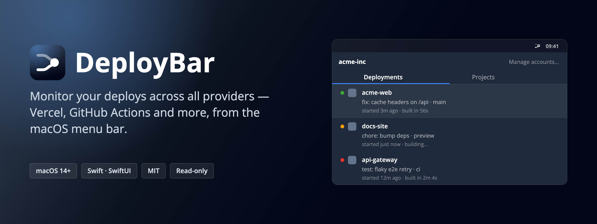

<h1>
  
  DeployBar
</h1>

**Native macOS menu bar app for monitoring Vercel deployments and GitHub Actions runs at a glance.**

[](https://github.com/friends-of-deploy/deploybar/actions/workflows/ci.yml)
[](https://developer.apple.com/macos/)
[](LICENSE)

---

## Features

**Menu bar**
- The icon carries the current state by *shape*, so it stays readable in light and dark bars:

  | | State | Reads as |
  |---|---|---|
  | <picture><source media="(prefers-color-scheme: dark)" srcset="docs/brand/png/menubar-idle-dark.png" /></picture> | Idle | Rocket upright, engine cold — nothing to report |
  | <picture><source media="(prefers-color-scheme: dark)" srcset="docs/brand/png/menubar-deploying-dark.png" /></picture> | Deploying | Rocket climbing, exhaust trailing behind it |
  | <picture><source media="(prefers-color-scheme: dark)" srcset="docs/brand/png/menubar-failed-dark.png" /></picture> | Failure | Rocket upright with an alert badge on the hull |
  | <picture><source media="(prefers-color-scheme: dark)" srcset="docs/brand/png/menubar-idle-dark.png" /></picture> | Signed out | The idle rocket, greyed back |

- Lives in the menu bar only; no Dock icon
- Right-click the icon for quick Settings / Quit

> Colour lives *inside* the popover (green / amber / red dots per deployment), never in the bar
> itself — macOS only recolours a status item reliably when the icon is a monochrome template image.

**Sources**
- **Vercel** — deployments and projects, reusing your Vercel CLI login
- **GitHub** — Actions workflow runs and repositories, reusing your GitHub CLI (`gh`) login or a personal access token
- A scope dropdown in the popover switches between your Vercel personal account, any Vercel team, and each connected GitHub account — every list shows exactly the selected source

**Deployments tab**
- Per-deployment rows: status dot, favicon (or repo owner avatar), project name, commit message, branch, and timing ("started 3m ago · built in 56s")
- Click a successful deployment → opens the live site (or the run page for GitHub); click a failed one → opens build logs
- Row actions: open deployment/run, open build logs, open the Actions overview (GitHub), open the source commit
- Failed rows: one click copies a paste-ready error report — build log tail for Vercel, failed jobs/steps plus log tail for GitHub Actions

**Projects tab**
- Vercel projects: favicon, production branch, framework, cron count, latest-deploy state and time
- GitHub repositories: owner avatar, default branch, language, stars, open issues, private badge, and CI state ("✓ passed 2h ago") derived from the latest fetched run
- Quick links: open production site, open repository
- Overflow menu (⋯) — Vercel: environment variables, Analytics (when enabled), project settings, dashboard; GitHub: pull requests, issues, repository settings

**Notifications**
- System notifications on deployment/run events across all connected accounts
- Failure and Success alerts on by default; Started and Canceled off by default
- Per-project opt-out available in Settings

**Settings**
- Configurable poll interval (default 30 seconds)
- Four notification event toggles
- Follow/unfollow projects per account, with a filter field for long lists
- Accounts tab: see CLI-connected accounts, add token-based accounts
- Launch at login

---

## How It Works / Auth

DeployBar reuses the CLI sessions you already have. On launch it reads:

| File | Purpose |
|------|---------|
| `~/Library/Application Support/com.vercel.cli/auth.json` | Your Vercel access token, expiry, and refresh token |
| `~/Library/Application Support/com.vercel.cli/config.json` | Your active Vercel team |
| `gh auth token` (GitHub CLI) | Your GitHub session, when `gh` is installed and logged in |

No separate API key setup is required — if you have run `vercel login` (and optionally `gh auth login`), DeployBar is ready to go. You can also add accounts manually with a personal access token in **Settings → Accounts**; those tokens are stored in the macOS Keychain. The scope dropdown selection is stored locally and never modifies the CLIs' own config.

DeployBar automatically renews expiring Vercel CLI access tokens using the saved refresh token and atomically saves the updated credentials to `auth.json`. This keeps background polling working without running a CLI command or signing in again. Temporary network failures preserve the saved login; an expired or revoked refresh token still requires `vercel login`.

**DeployBar is strictly read-only.** It never creates, modifies, or deletes any resource on Vercel or GitHub.

**Privacy**: authentication tokens are sent only to their provider's API. Network requests go to:
- `api.vercel.com` — deployments, projects, teams, profile, and CLI token renewal
- `api.github.com` — repositories and workflow runs (only when a GitHub account is connected)
- your project domains and `avatars.githubusercontent.com` — favicons / repo avatars
- `www.google.com/s2/favicons` — favicon fallback for sites that don't serve `/favicon.ico`

Icons are cached on disk so these lookups happen rarely.

---

## Requirements

- macOS 14.0 (Sonoma) or later
- [Vercel CLI](https://vercel.com/docs/cli) installed and logged in (`npm i -g vercel && vercel login`)
- Optional: [GitHub CLI](https://cli.github.com) logged in (`gh auth login`) for GitHub Actions monitoring

To **build from source**, you also need:
- Xcode 15 or later
- [XcodeGen](https://github.com/yonaskolb/XcodeGen)

---

## Install

### Homebrew (recommended)

```bash
brew install --cask friends-of-deploy/tap/deploybar
```

`brew` resolves `friends-of-deploy/tap` to the
[friends-of-deploy/homebrew-tap](https://github.com/friends-of-deploy/homebrew-tap)
repository automatically. The cask installs a signed, notarized build, so there
is no Gatekeeper prompt on first launch.

To upgrade later:

```bash
brew upgrade --cask deploybar
```

### From Source

1. Install XcodeGen if you don't have it:

   ```bash
   brew install xcodegen
   ```

2. Clone the repository and generate the Xcode project:

   ```bash
   git clone https://github.com/friends-of-deploy/deploybar.git
   cd deploybar
   xcodegen generate
   ```

3. **Option A — Xcode**: open `DeployBar.xcodeproj`, select the `DeployBar` scheme, and press Run.

   **Option B — command line**: build and install to `/Applications`:

   ```bash
   xcodebuild -project DeployBar.xcodeproj \
              -scheme DeployBar \
              -configuration Release \
              -derivedDataPath build
   cp -R build/Build/Products/Release/DeployBar.app /Applications/
   ```

> **Gatekeeper note**: A from-source build is unsigned, so macOS may block it on
> first launch. Right-click (or Control-click) `DeployBar.app` in Finder and
> choose **Open**, then confirm in the dialog. (The Homebrew cask above is
> notarized and does not have this issue.)

### Releases

Notarized release builds are published on the [GitHub Releases](https://github.com/friends-of-deploy/deploybar/releases) page as a drag-and-drop `.dmg` if you prefer not to use Homebrew.

---

## Configuration

Open the popover and click the gear icon to open Settings.

| Setting | Default | Description |
|---------|---------|-------------|
| Poll interval | 30 seconds | How often DeployBar fetches from the provider APIs |
| Notify on Failure | On | System notification when a deployment/run fails |
| Notify on Success | On | System notification when a deployment/run succeeds |
| Notify on Started | Off | System notification when a deployment/run starts |
| Notify on Canceled | Off | System notification when a deployment/run is canceled |
| Auto-follow new projects | On | Follow newly discovered projects automatically |
| Per-project follow toggles | All on | Unfollowed projects are hidden and never notify |
| Launch at login | Off | Start DeployBar automatically when you log in |

The Accounts tab lists the connected sources (Vercel CLI, GitHub CLI, token accounts) and lets you add a token-based account for either provider.

---

## Development

### Project Layout

```
DeployBar/
  Models/      — Deployment, Project, Team, Account, Scope, VercelUser, GitHub DTOs
  Clients/     — VercelClient, GitHubClient, TeamsClient, UserClient, TokenProvider, GitHubTokenProvider
  Stores/      — DeploymentStore (@Observable, drives the UI), AccountStore, SettingsStore
  Services/    — FaviconCache, FaviconURL, NotificationManager, LinkBuilder, LaunchAtLogin, DeploymentDiffer
  Views/       — PopoverView, DeploymentRow, ProjectRow, SettingsView, MenuBarIcon, StatusDot, FaviconView
  Assets.xcassets/ — AppIcon, five MenuBar* template imagesets, DocumentIcon
DeployBarTests/
  — 180+ unit tests covering decoding, aggregation, scope filtering, diffing, notification gating, link building, localization, and more
```

The architecture is layered: clients are pure value types that accept an injectable `fetch` closure, making them straightforward to test without network access. GitHub data is mapped onto the same `Deployment`/`Project` models at the client boundary, so the UI is provider-agnostic. `DeploymentStore` is the single `@Observable` object that the SwiftUI views observe.

### Running Tests

```bash
xcodegen generate   # only needed once, or after editing project.yml
xcodebuild test \
  -project DeployBar.xcodeproj \
  -scheme DeployBar \
  -destination 'platform=macOS'
```

### Demo mode

Screenshots for the docs are taken against an invented fixture world rather than
real accounts, so images stay clean and comparable between releases.

```bash
scripts/demo.sh                      # live: builds progress, new runs arrive
scripts/demo.sh --freeze             # pins the demo data clock
scripts/demo.sh --release --freeze   # same, from the Release artifact
scripts/demo.sh --scenario onboarding
```

Demo mode is off unless `DEPLOYBAR_DEMO=1` is set, runs on a throwaway defaults
suite and an in-memory credential store, and never touches real accounts,
settings or the Keychain.

Scenarios live in `DeployBar/Demo/Fixtures/*.json`. To add one, copy
`default.json`, edit it, and pass its name to `--scenario`. Deployment times are
relative (`ageSeconds`), so fixtures never go stale. `DemoScenarioTests` verifies
the shipped fixture decodes and is internally consistent — run the suite after
editing one.

`--freeze` pins the demo data clock, so build states stop progressing and no new
deployments arrive. Known limitation: relative timestamps in the UI (e.g.
"started 7m ago") are still formatted against the live system clock, so two runs
taken minutes apart will still differ in those strings.

---

## Contributing

See [CONTRIBUTING.md](CONTRIBUTING.md) for guidelines on reporting issues and submitting pull requests.

---

## Brand


The mark is a rocket — a deploy going up. It carries the state by *shape*, so the
same drawing reads in a light bar, a dark bar, and knocked out to white while the
menu is open. Source artwork lives in [`docs/brand/`](docs/brand): the five master
SVGs in `svg/`, exported PNGs in `png/`, favicons and the og image in `web/`, and
`DeployBar.iconset` + `make-icns.sh` for the `.icns`.

Menu bar glyphs are template images — pure black plus alpha, on an 18 pt canvas
with the glyph capped at 60 × 60 units of a 72-unit grid. Never tint them in code;
macOS inverts and dims them for you. Nothing thinner than ~1.1 pt, and the window is
knocked out of the hull rather than drawn on top, so it survives at 1×.

Palette (app icon and marketing only): ink top `#334155` → ink base `#020617`, cold
light `#60A5FA` at 45%, rocket `#FFFFFF`. Tile corner radius is 114 / 512 (22.3%).
Status colors: green `#3AAA35`, amber `#F59E0B`, red `#E7332A`, tab accent `#3B82F6`.
Type: Open Sans (700 wordmark, 600 labels, 400 body), JetBrains Mono for code.

Leave one rocket-width of clear space around the lockup. Colour lives inside the
popover, never in the bar.

---

## License

MIT — see [LICENSE](LICENSE).

---

## Disclaimer

DeployBar is an unofficial, community-built project. It is not affiliated with, endorsed by, or supported by Vercel Inc. or GitHub Inc.
